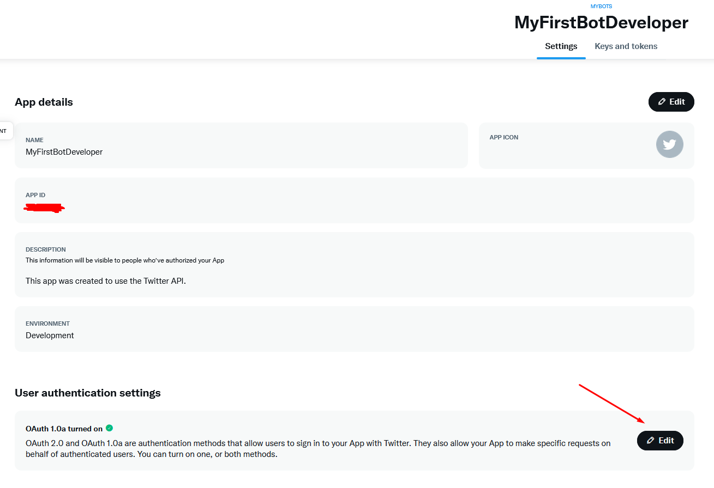
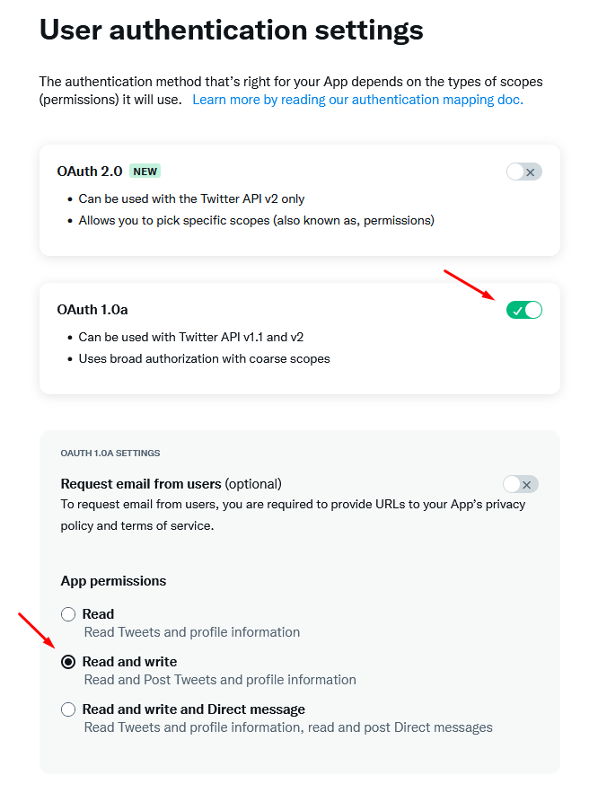
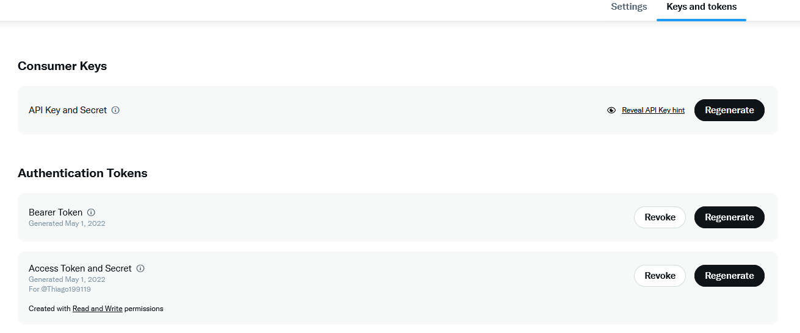

# Bot Twitter com twitter4j

##Abaixo vou descrever passo a passo para solicitar acesso a API do Twitter

1. Acesse o link https://developer.twitter.com/en
2. Preencha as informações necessárias e responda as perguntas sobre o caso de uso da API (pode ser que eles ao analisarem lhe enviem um e-mail para mais perguntas).
3. Após a liberação você receberá um e-mail com a confirmação para acessar a área do Twitter Developer.
4. Acessanado a área (nesse momento você receberá as suas Keys and Tokens), no lado esquerdo você tem as opcões de criar projetos, seguindo para criar seus App ou você pode criar direto seu App.

5.Após criar seu App, vá na indicação abaixo para alterarmos as permissões do App para Read & Write.

6. Selecione as opções abaixo.

7. Caso você precise regerar suas Keys and Tokens só acessar as opcões abaixo (caso você perca elas o Twitter não tem a opção de ver ou recuperar, você precisa gerar elas novamente e salvar em algum arquivo).

##Utilizando a biblioteca twitter4j

1. No link a seguir tem toda a documentação necessária para configuração e métodos.

https://twitter4j.org/en/index.html